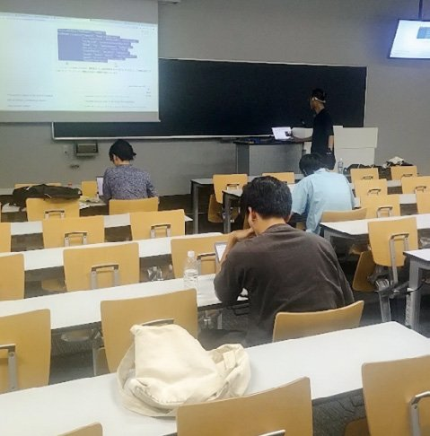
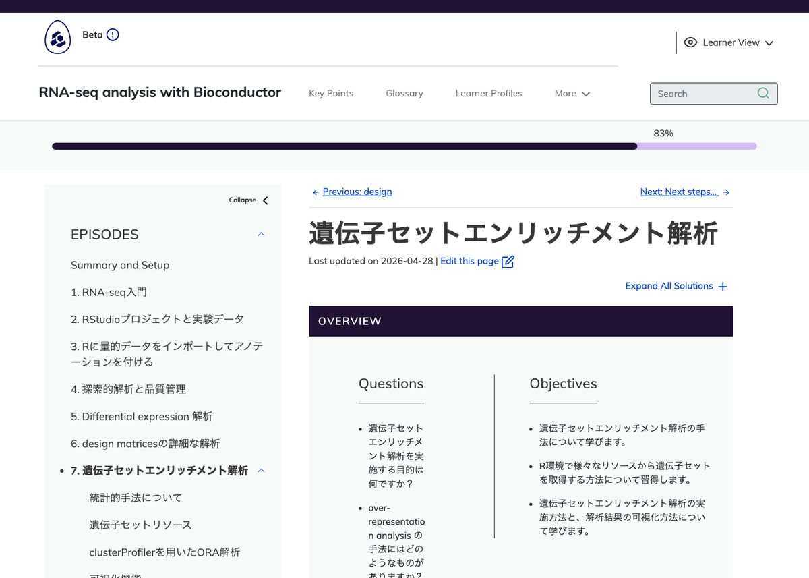

## An apology first

This post should have been written a year ago. The two workshops it describes
took place in August and September 2025, and a report in Japanese appeared in
the newsletter of the Japanese Society for Bioinformatics (JSBi) in January
2026. The report to the wider, English-speaking Bioconductor community is only
arriving now, in September 2026.

I am sorry for the delay. I owe this apology to the participants, helpers and
co-hosts who made the workshops happen, and to everyone in the Bioconductor
community who has been curious about how teaching Bioconductor in a local
language went in Japan. Part of the reason for the delay is explained later in
this post, because it is tied to the future of our translation infrastructure.

## The first Bioconductor Carpentries workshops taught in Japanese

Bioconductor has been a member organisation of
[The Carpentries](https://carpentries.org/) since August 2022
([announcement](https://blog.bioconductor.org/posts/2022-07-12-carpentries-membership/)).
The Bioconductor Training Committee maintains a set of Carpentries-style
[lesson modules](https://training.bioconductor.org/#modules), ranging from an
introduction to R and Bioconductor to an advanced course on bulk RNA-seq
analysis. How these lessons are developed and taught is described in
[Drnevich et al. (2025), *PLOS Computational Biology*](https://doi.org/10.1371/journal.pcbi.1012925).

Bringing this training to communities around the world in their own languages
is supported by the Chan Zuckerberg Initiative (CZI) Essential Open Source
Software for Science (EOSS) grant
[*Delivering High Quality Bioconductor Training for a Worldwide Community*](https://chanzuckerberg.com/eoss/proposals/delivering-high-quality-bioconductor-training-for-a-worldwide-community/).

As part of that effort, the Japanese Bioconductor community organised two
two-day workshops in 2025, co-hosted with the
[Japanese Society for Bioinformatics (JSBi)](https://www.jsbi.org/). To our
knowledge these were the first Bioconductor workshops ever taught in Japanese.
Both were hybrid events, with an in-person classroom and a Zoom connection for
remote participants. I (Kozo Nishida) was the instructor for both. I serve on
the Bioconductor Community Advisory Board and in the working group that
translates Bioconductor teaching materials, and these workshops were the first
time our Japanese translations were used in front of a class.

### Workshop 1: Introduction to R and Bioconductor (Osaka, 5–6 August 2025)

The first workshop took place at the Taniguchi Memorial Hall in the Integrated
Life Science Building of the Research Institute for Microbial Diseases, Osaka
University, with Naohisa Goto as helper and local host.

- **Day 1** followed the Japanese translation of
  [*Introduction to data analysis with R and Bioconductor*](https://bioconductor-translations.github.io/bioc-intro-ja/)
  (`bioc-intro`): how to organise data for analysis, then data manipulation and
  visualisation with the tidyverse packages, taught by live coding with every
  participant typing along.
- **Day 2** followed the Japanese translation of
  [*The Bioconductor project*](https://bioconductor-translations.github.io/bioc-project-ja/)
  (`bioc-project`): installing Bioconductor packages, getting help, S4 classes,
  biological sequences, `GenomicRanges`, annotation resources and
  `SummarizedExperiment`.

The [workshop website](https://bioconductor-translations.github.io/2025-08-05-osaka/)
and [slides](https://bioconductor-translations.github.io/2025-08-05-osaka-slides/)
are online, in Japanese.

### Workshop 2: RNA-seq analysis with Bioconductor (Kyoto, 11–12 September 2025)

The second workshop was the advanced course, held at the Inamori Memorial Hall
of Kyoto Prefectural University, with Atsushi Fukushima as helper and local
host. We used the Japanese translation of
[*RNA-seq analysis with Bioconductor*](https://bioconductor-translations.github.io/bioc-rnaseq-ja/)
(`bioc-rnaseq`) and live-coded the whole bulk RNA-seq workflow, apart from the
read quantification step that produces the count matrix.

- **Day 1** covered an introduction to RNA-seq, RStudio projects and the
  experimental data, importing quantified data into R and annotating it, and
  exploratory analysis and quality control, everything that comes before
  differential expression analysis.
- **Day 2** covered differential expression analysis, a closer look at design
  matrices, and gene set enrichment analysis for interpreting the results.

{fig-alt="A lecture room at Kyoto Prefectural University during the second workshop. Participants sit at long desks with laptops while the instructor stands at the front next to a screen showing R code." fig-align="center"}

{fig-alt="Screenshot of the Japanese translation of the RNA-seq analysis with Bioconductor lesson, showing the gene set enrichment analysis episode with its questions and objectives in Japanese." fig-align="center"}

The [workshop website](https://bioconductor-translations.github.io/2025-09-11-kyoto/)
and [slides](https://bioconductor-translations.github.io/2025-09-11-kyoto-slides/)
are online as well.

### Who took part

| Workshop | In person | Online |
|----------|-----------|--------|
| Osaka, August 2025 | about 3 | about 45 |
| Kyoto, September 2025 | about 6 | about 45 |

Attendance fluctuated over the two long days, so these are approximate
numbers. Most participants joined online, which reflects how geographically
spread out the Japanese bioinformatics community is. The hybrid format clearly
lowered the barrier to attending.

We are grateful to JSBi for co-hosting, to the venue hosts at Osaka University
and Kyoto Prefectural University, and above all to everyone who took part. We
intend to keep running and improving these workshops. Our hope is that
participants will not only learn from them but go on to teach, so that the
circle keeps widening.

A report on both workshops, written in Japanese together with Naohisa Goto and
Atsushi Fukushima, appeared in
[JSBi Newsletter No. 48 (January 2026, PDF in Japanese)](https://www.jsbi.org/media/files/_u/topic/file/nl48.pdf).

## Where the materials live

Everything we used is in the
[bioconductor-translations](https://github.com/bioconductor-translations)
GitHub organisation, and anyone is welcome to use it for their own teaching:

- Japanese lesson translations:
  [bioc-intro-ja](https://github.com/bioconductor-translations/bioc-intro-ja),
  [bioc-project-ja](https://github.com/bioconductor-translations/bioc-project-ja) and
  [bioc-rnaseq-ja](https://github.com/bioconductor-translations/bioc-rnaseq-ja).
- Workshop websites and slides:
  [2025-08-05-osaka](https://github.com/bioconductor-translations/2025-08-05-osaka),
  [2025-08-05-osaka-slides](https://github.com/bioconductor-translations/2025-08-05-osaka-slides),
  [2025-09-11-kyoto](https://github.com/bioconductor-translations/2025-09-11-kyoto) and
  [2025-09-11-kyoto-slides](https://github.com/bioconductor-translations/2025-09-11-kyoto-slides).
- The organisation also hosts the French translation
  [bioc-intro-fr](https://bioconductor-translations.github.io/bioc-intro-fr/),
  which was used in the
  [Bioconductor course in Benin](https://blog.bioconductor.org/posts/2025-12-11-benin-course/).

## Why this post is late, and what I have learned about our translation setup

Here is the honest part. One reason this post took so long is that I have not
been able to maintain [bioconductor.crowdin.com](https://bioconductor.crowdin.com/)
and the [bioconductor-translations](https://github.com/bioconductor-translations)
repositories the way they deserve, and I felt guilty writing a cheerful report
about workshops while the infrastructure behind them was falling behind.

Some background. I was the one who proposed that the Bioconductor community use
Crowdin to manage translations. The model was
[The Turing Way](https://turingway.crowdin.com/), which translates its
handbook on Crowdin with great success. Crowdin's support for open-source
projects has been generous, and I remain very grateful for it.

However, the two projects differ in an important way. The Turing Way's source
documents are plain Markdown. The Carpentries lessons are written in R
Markdown, with executable code chunks and lesson-specific fenced blocks for
callouts, challenges and solutions. To feed them into Crowdin we had to
convert R Markdown to Markdown into separate translation repositories, sync
the translated strings back, and reassemble buildable lessons from the result.
The Crowdin and GitHub integration that this requires is complex and fragile,
and it is not easy to manage.

At the same time, the world has changed since I made that proposal. AI
translation quality has improved substantially, and with
[Agent Skills](https://agentskills.io/) an AI agent can now translate
according to project rules: a shared glossary, consistent terminology, and
clear instructions about what to leave untouched, such as code, package names
and function names. Under these conditions, managing translations directly in
GitHub, with translated lessons living alongside their sources and reviewed
through pull requests, is more efficient than keeping a Crowdin and GitHub
integration alive.

So, in order to speed up the multilingualisation of Bioconductor teaching
materials, I no longer think we should keep using
[bioconductor.crowdin.com](https://bioconductor.crowdin.com/), and I intend
to retire it. This is not a complaint about Crowdin. It is a recognition that
the tool was the right one for a different kind of source document, and that
a simpler workflow now serves our lessons better.

## What comes next

I am setting up new, GitHub-only translation repositories together with an
Agent Skill for rule-following AI translation, its documentation, and the
outreach needed to bring more languages and more contributors on board. This
work is supported by the
[Bioconductor Developer Champions Program](https://bioconductor.org/developers/developer-champions-program/).

Please give me a little more time before the formal announcement. When it is
ready, I will share it here on the blog.

## Get involved

- Teach with the materials. The Japanese lessons, the workshop websites and the
  slides linked above are openly licensed and free for anyone to use.
- If you are interested in translating Bioconductor teaching materials into
  your own language, watch the
  [bioconductor-translations](https://github.com/bioconductor-translations)
  organisation for the upcoming announcement.
- Join the Bioconductor community through the
  [support site](https://www.bioconductor.org/help/support/) and the
  [community chat](https://chat.bioconductor.org/).

## Acknowledgements

Thank you to Naohisa Goto and Atsushi Fukushima for helping at and hosting the
workshops, to JSBi for co-hosting them, and to every participant. This work
was supported by the
[Chan Zuckerberg Initiative EOSS program](https://chanzuckerberg.com/eoss/proposals/delivering-high-quality-bioconductor-training-for-a-worldwide-community/)
and by the
[Bioconductor Developer Champions Program](https://bioconductor.org/developers/developer-champions-program/).
